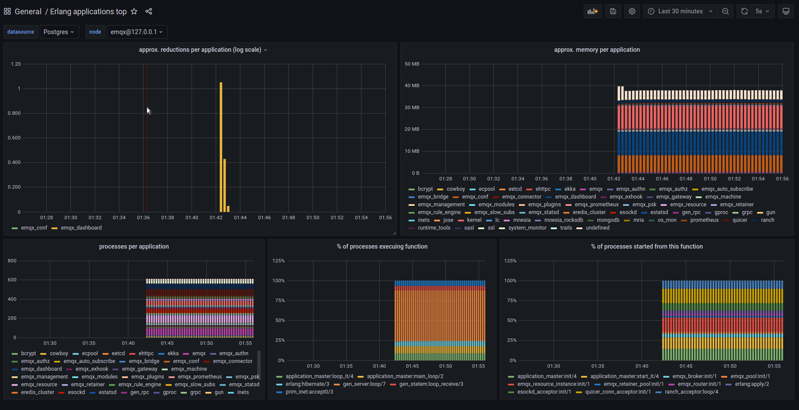

# system_monitor
> Erlang telemetry collector

[![Build Status][ci-image]][ci-url]
[![License][license-image]][license-url]
[![Developed at Klarna][klarna-image]][klarna-url]

`system_monitor` is a BEAM VM monitoring and introspection application
that helps troubleshooting live systems. It collects various
information about Erlang processes and applications.
Unlike `observer`, `system_monitor` does not require
connecting to the monitored system via Erlang distribution protocol,
and can be used to monitor systems with very tight access
restrictions.

## Features

### Process top

Information about top N Erlang processes consuming the most resources
(such as reductions or memory), or have the longest message queues, is
presented on process top dashboard:


Historical data can be accessed via standard Grafana time
picker. `status` panel can display important information about the
node state. Pids of the processes on that dashboard are clickable
links that lead to the process history dashboard.

### Process history


Process history dashboard displays time series data about certain
Erlang process. Note that some data points can be missing if the
process didn't consume enough resources to appear in the process top.

### Application top


Application top dashboard contains various information aggregated per
OTP application.

## Usage example

In order to integrate `system_monitor` into your system, simply add it
to the release apps. Add the following lines to `rebar.config`:

```erlang
{deps, [..., system_monitor]}.

{relx,
 [ {release, {my_release, "1.0.0"},
    [kernel, sasl, ..., system_monitor]}
 ]}.
```

Add the following configuration to `sys.config` to enable export of
telemetry to Kafka:

```erlang
{system_monitor,
   [ {callback_mod, your_callback_mod}]}
```

### Custom node status

`system_monitor` can export arbitrary node status information that is
deemed important for the operator. This is done by defining a callback
function that returns an HTML-formatted string (or iolist):

```erlang
-module(foo).

-export([node_status/0]).

node_status() ->
  ["my node type<br/>",
   case healthy() of
     true  -> "<font color=#0f0>UP</font><br/>"
     false -> "<mark>DEGRADED</mark><br/>"
   end,
   io_lib:format("very important value=~p", [very_important_value()])
  ].
```

This callback then needs to be added to the system_monitor application
environment:

```erlang
{system_monitor,
   [ {node_status_fun, {foo, node_status}}
   ...
   ]}
```

More information about configurable options is found [here](src/system_monitor.app.src).

## How to contribute

See our guide on [contributing](.github/CONTRIBUTING.md).

## Release History

See our [changelog](CHANGELOG.md).

## License

Copyright © 2020 Klarna Bank AB

For license details, see the [LICENSE](LICENSE) file in the root of this project.


<!-- Markdown link & img dfn's -->
[ci-image]: https://img.shields.io/badge/build-passing-brightgreen?style=flat-square
[ci-url]: https://github.com/klarna-incubator/TODO
[license-image]: https://img.shields.io/badge/license-Apache%202-blue?style=flat-square
[license-url]: http://www.apache.org/licenses/LICENSE-2.0
[klarna-image]: https://img.shields.io/badge/%20-Developed%20at%20Klarna-black?labelColor=ffb3c7&style=flat-square&logo=
[klarna-url]: https://github.com/klarna-incubator
